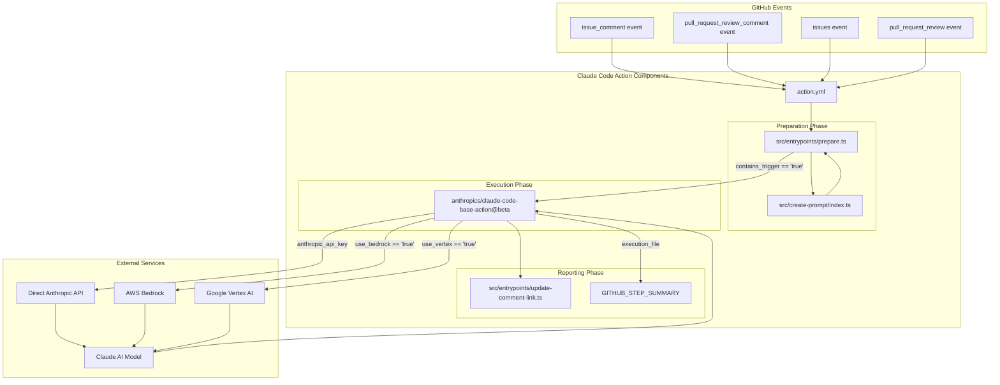
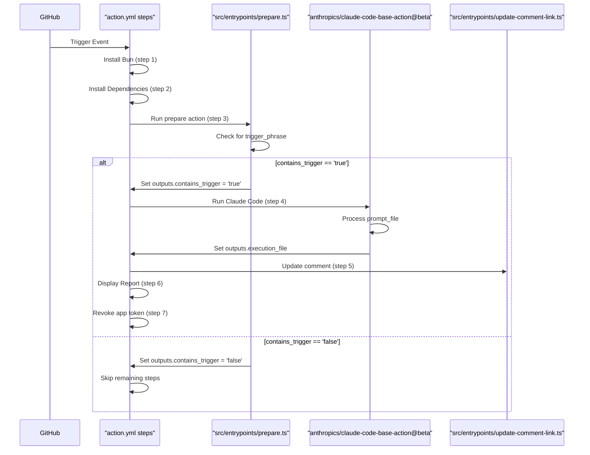
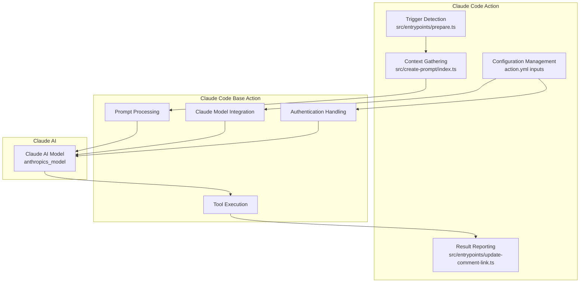

# Overview

<details>
<summary>Relevant source files</summary>

The following files were used as context for generating this wiki page:

- [README.md](README.md)
- [action.yml](action.yml)

</details>

Claude Code Action is a GitHub Action that integrates Claude AI with GitHub workflows, enabling intelligent assistance for Pull Requests and Issues. This action allows Claude to respond to comments, review code, and implement changes when triggered by specific phrases or events.

This page provides a high-level overview of the system, its architecture, and key functionality. For detailed setup instructions, see [Getting Started](#2), and for configuration details, see [Configuration Options](#4).

## Purpose and Scope

The Claude Code Action repository provides a general-purpose GitHub Action that connects Claude AI models with GitHub workflows. It enables Claude to:

- Answer questions about code, architecture, and programming
- Perform code reviews on pull requests
- Implement fixes, refactoring, or new features
- Interact with users through GitHub comments and issues

The action serves as a bridge between GitHub's collaboration features and Claude's AI capabilities, making AI assistance accessible directly within the development workflow.

Sources: [action.yml:1-2](), [README.md:1-3]()

## System Architecture

The following diagram illustrates the high-level architecture of the Claude Code Action system:



Sources: [action.yml:64-167](), [README.md:193-201]()

### Core Components

1. **Action Definition**: The `action.yml` file defines the GitHub Action, its inputs, outputs, and execution steps.

2. **Preparation Components**:

   - `prepare.ts`: Detects triggers in GitHub events and prepares context for Claude
   - `create-prompt`: Generates appropriate prompts based on the context

3. **Execution Component**:

   - `claude-code-base-action`: The underlying action that interfaces with Claude AI

4. **Reporting Components**:

   - `update-comment-link.ts`: Updates GitHub comments with execution results
   - Display Report: Summarizes results in the workflow summary

5. **Authentication Methods**:
   - Direct Anthropic API using an API key
   - AWS Bedrock with OIDC authentication
   - Google Vertex AI with OIDC authentication

Sources: [action.yml:7-53](), [README.md:262-269]()

## Execution Workflow

The following sequence diagram shows how Claude Code Action processes GitHub events:



Sources: [action.yml:64-167]()

### Key Steps

1. **Setup Environment**: The action installs Bun and dependencies
2. **Prepare Action**: `prepare.ts` checks for trigger phrases and gathers context
3. **Trigger Detection**: If a trigger is found, the workflow continues
4. **Claude Execution**: The base action sends the prompt to Claude
5. **Reporting**: Results are posted to GitHub via comment updates and workflow summaries
6. **Cleanup**: The GitHub app token is revoked for security

## Configuration Options

Claude Code Action offers extensive configuration options through inputs defined in `action.yml`:

| Category       | Key Input             | Description                                                |
| -------------- | --------------------- | ---------------------------------------------------------- |
| Triggers       | `trigger_phrase`      | Phrase that activates Claude (default: `@claude`)          |
|                | `assignee_trigger`    | Username that triggers action when assigned                |
|                | `direct_prompt`       | Direct instruction for Claude (bypasses trigger detection) |
| Claude         | `anthropic_model`     | Claude model to use                                        |
|                | `allowed_tools`       | Additional tools Claude can use                            |
|                | `custom_instructions` | Additional instructions for Claude                         |
| Authentication | `anthropic_api_key`   | Anthropic API key for direct access                        |
|                | `use_bedrock`         | Use AWS Bedrock with OIDC authentication                   |
|                | `use_vertex`          | Use Google Vertex AI with OIDC authentication              |
| Other          | `timeout_minutes`     | Timeout for Claude execution                               |

For detailed configuration information, see [Configuration Options](#4).

Sources: [action.yml:7-57]()

## Usage Patterns

Claude Code Action can be triggered in several ways:

### Comment-Based Triggers

The most common pattern is mentioning Claude in a comment:

```
@claude Please review this PR and suggest improvements
```

### Assignee-Based Triggers

Issues can be assigned to a specific user to trigger Claude:

```yaml
assignee_trigger: "claude"
```

### Automated Workflows

For automated workflows, direct prompts can be provided:

```yaml
direct_prompt: "Review this PR for security vulnerabilities"
```

### Event-Based Triggers

The action can run on various GitHub events:

```yaml
on:
  issue_comment:
    types: [created]
  pull_request_review_comment:
    types: [created]
  issues:
    types: [opened, assigned]
  pull_request_review:
    types: [submitted]
```

For detailed examples of different usage patterns, see [Usage Examples](#6).

Sources: [README.md:87-146](), [action.yml:7-15]()

## Relationship with Base Action

Claude Code Action builds upon and extends the functionality of `anthropics/claude-code-base-action@beta`. The responsibilities are divided as follows:



This modular design allows:

- Claude Code Action to focus on GitHub integration and context preparation
- Claude Code Base Action to handle AI processing and tool execution
- Future enhancements to either component without disrupting the overall system

Sources: [action.yml:92-105](), [README.md:201]()

## Security Considerations

Claude Code Action includes several important security features:

1. **Access Control**: Only users with write access to the repository can trigger the action
2. **Token Management**: Uses short-lived tokens with limited scope
3. **Commit Signing**: All commits made by Claude are automatically signed
4. **API Key Protection**: Requires sensitive credentials to be stored in GitHub secrets

For comprehensive security information, see [Security Considerations](#9.2).

Sources: [README.md:359-448](), [action.yml:158-167]()

## Capabilities and Limitations

### What Claude Can Do

- Answer questions about code and architecture
- Implement code changes via commits
- Review pull requests and provide feedback
- Create new branches for work from issues
- Push directly to open PR branches

### What Claude Cannot Do

- Submit formal GitHub PR reviews
- Approve pull requests
- Post multiple independent comments
- Execute commands outside its context
- Run arbitrary bash commands by default

For a complete understanding of Claude Code Action capabilities, see [Usage Examples](#6).

Sources: [README.md:204-226]()
