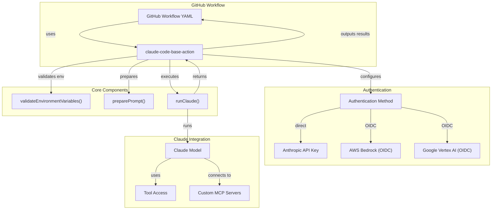
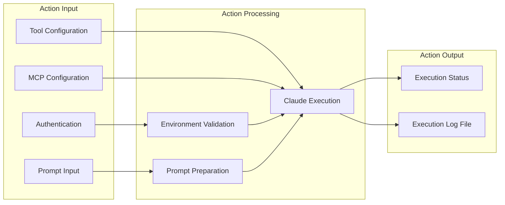
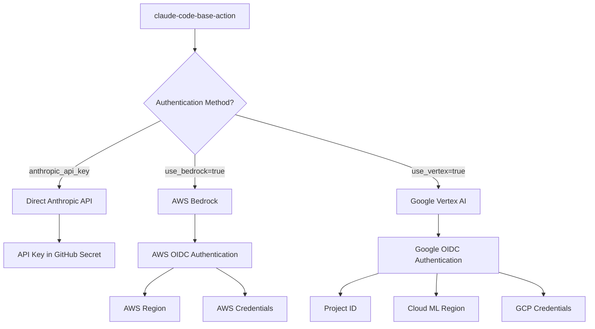
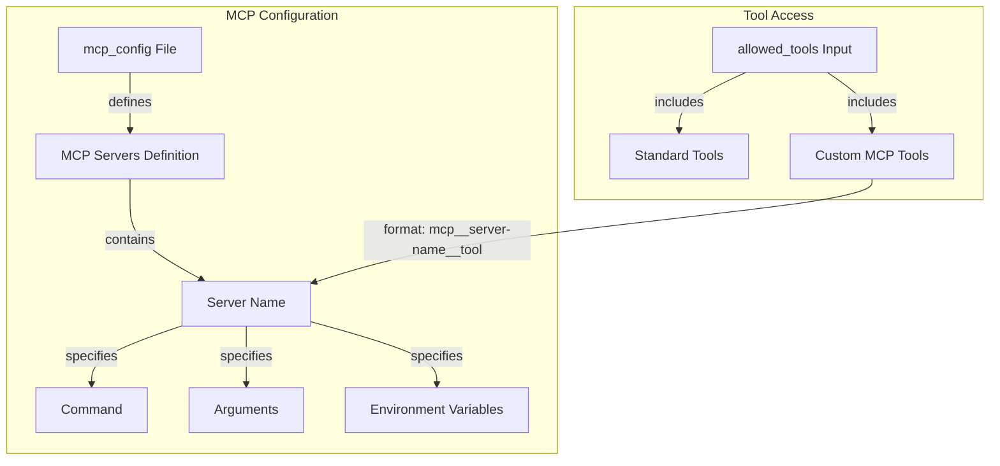
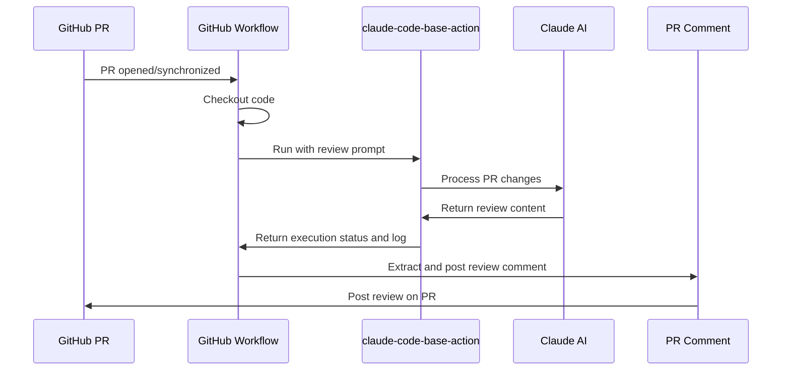

# Overview

Relevant source files

The following files were used as context for generating this wiki page:

- [LICENSE](LICENSE)
- [README.md](README.md)

This document provides a comprehensive introduction to the Claude Code Base Action, a GitHub Action that enables running Anthropic's Claude AI model within GitHub Actions workflows. The action serves as a foundation for building custom workflows powered by Claude's code understanding capabilities.

For more detailed information about how to get started with the action, see [Getting Started](#2). For configuration details, see [Action Configuration](#3).

## Purpose and Scope

The Claude Code Base Action provides a flexible interface for integrating Claude Code into GitHub workflows. It enables GitHub users to:

1. Run Claude Code with custom prompts
2. Control which tools Claude can access
3. Configure authentication with different providers
4. Build custom automation for code analysis, review, and other tasks

Unlike the simpler [Claude Code action](https://github.com/anthropics/claude-code-action) which focuses solely on tagging `@claude` in issues and PRs, this action offers more extensive customization and integration options for advanced workflows.

Sources: [README.md:1-5]()

## System Architecture

The Claude Code Base Action integrates several components to enable communication between GitHub workflows and Claude's AI capabilities.

Sources: [README.md:7-37](), [README.md:169-222]()

## Key Components

The Claude Code Base Action consists of several key components that work together to provide its functionality:

1. **GitHub Action Definition**: Configures inputs, outputs, and runtime environment
2. **Environment Validation**: Ensures proper authentication and environment setup
3. **Prompt Handling**: Processes user-provided prompts (inline or from files)
4. **Claude Execution**: Manages communication with the Claude model
5. **MCP Configuration**: Enables custom server integration
6. **Output Processing**: Captures and formats Claude's responses

Sources: [README.md:38-63]()

## Authentication Methods

The action supports three different methods of authenticating with Claude:

### Authentication Flow

Sources: [README.md:169-184](), [README.md:224-262]()

## MCP Configuration System

The action supports Modular Computation Platform (MCP) configuration for integrating custom servers:

Sources: [README.md:64-106]()

## Common Use Cases

The Claude Code Base Action enables various use cases, with PR code review being a common example:

### PR Code Review Workflow

Sources: [README.md:108-164]()

## Security Considerations

When using the Claude Code Base Action, security best practices should be followed:

1. **API Keys**: Store API keys in GitHub Secrets, never in code
2. **OIDC Authentication**: Use short-lived tokens when possible
3. **Tool Permissions**: Limit Claude's access to only necessary tools

Sources: [README.md:264-298]()

## License

The Claude Code Base Action is licensed under the MIT License, allowing for flexible use, modification, and distribution.

Sources: [LICENSE:1-21](), [README.md:300-302]()
